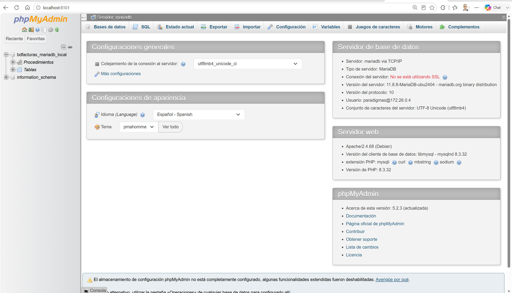

# Tutorial — Administrar la base de datos MariaDB con phpMyAdmin

> Tutorial paso a paso para explorar y administrar **bdfacturas** (la BD del
> proyecto) usando **phpMyAdmin**, el administrador web de MariaDB que ya
> viene incluido en el `docker-compose.yml` del proyecto — no hay que
> instalar nada.
>
> Prerrequisito: el proyecto corriendo (`docker compose up -d --build` en la
> raíz del repositorio, ver [README](../README.md)).

---

## Paso 1 — Abrir phpMyAdmin

phpMyAdmin es un contenedor más del proyecto (servicio `phpmyadmin` del
compose). Con el proyecto arriba, abra en su navegador:

**http://localhost:8101**

No pide usuario ni contraseña: el compose ya lo conecta al servidor MariaDB
con las credenciales del curso (`paradigmas` / `paradigmas123`). Debe ver la
página principal de phpMyAdmin y, en el panel izquierdo, la base de datos
**`bdfacturas_mariadb_local`**.

La página principal informa sobre los DOS servidores involucrados (fíjese
que son contenedores distintos): el **servidor de base de datos** (MariaDB,
al que phpMyAdmin se conecta por su nombre interno `mariadb`) y el
**servidor web** (Apache + PHP, donde corre phpMyAdmin mismo).

> 💡 **Nota:** phpMyAdmin guarda sus funcionalidades extendidas — entre
> ellas el **Diseñador** de diagramas — en una base de datos interna
> propia llamada `phpmyadmin` (el "almacenamiento de configuración"). En
> este proyecto esa BD ya viene creada por `db/init_phpmyadmin.sql`, que
> MariaDB ejecuta automáticamente la primera vez. Si alguna vez ve abajo
> la advertencia amarilla *"El almacenamiento de configuración phpMyAdmin
> no está completamente configurado"*, es señal de que esa BD interna
> falta (el arreglo: `docker compose down -v` y volver a subir — ojo,
> borra también los datos de bdfacturas).

---

## Paso 2 — Abrir la base de datos y ver sus tablas

En el panel izquierdo haga clic en **`bdfacturas_mariadb_local`**. Se abre
la pestaña **Estructura**: la lista de las **12 tablas** de bdfacturas con
su número de filas, motor (InnoDB) y tamaño.

<!-- img: paso 2 -->
